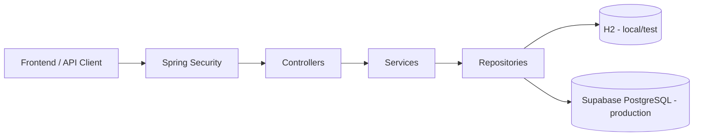
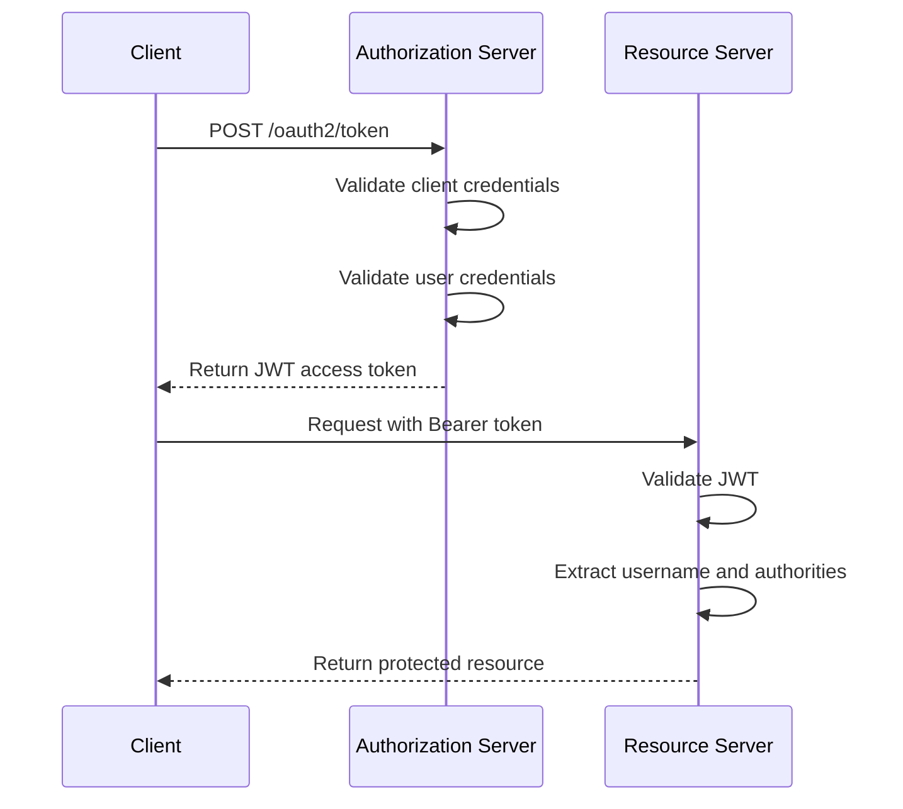
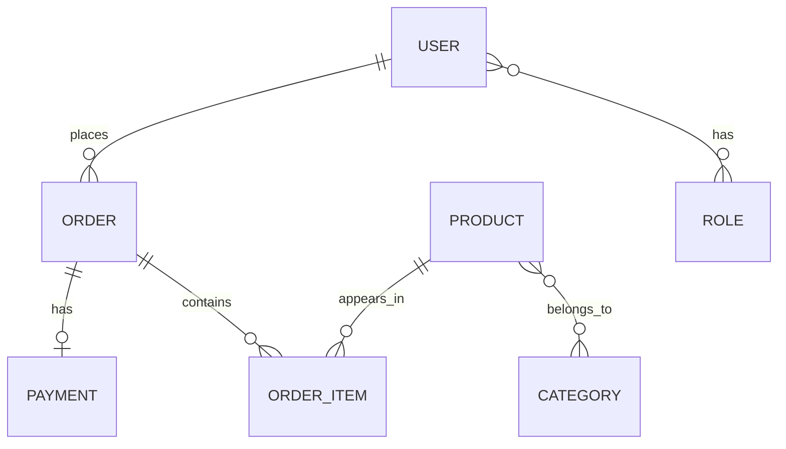

# DSCommerce - Spring Boot E-commerce Backend


A backend-focused e-commerce API built with Spring Boot, designed to showcase secure authentication and authorization, role-based access control, layered architecture, JPA entity relationships, validation, exception handling, automated tests, and production-oriented deployment.

This is the main backend project in my portfolio and reflects my focus on building secure, maintainable RESTful APIs with Java and Spring Boot.

**Live API:** https://project-spring-boot-dscommerce.onrender.com/
**Frontend demo:** [dscommerce-frontend.vercel.app](https://dscommerce-frontend.vercel.app/) — ([GitHub repo](https://github.com/mateusribeirocampos/dscommerce-frontend))


---

## Overview

DSCommerce is a RESTful backend for an e-commerce domain, covering core business entities such as users, roles, products, categories, orders, payments, and order items.

The project emphasizes:

- secure API access with JWT-based authentication
- role-based authorization for protected resources
- layered backend architecture
- JPA domain modeling and entity relationships
- validation and centralized exception handling
- environment-based configuration for local and production usage
- deployment to a cloud environment with PostgreSQL

---

## Key Features

- JWT-based authentication and authorization
- Role-based access control (public, authenticated, and admin routes)
- OAuth2 Authorization Server integration
- Layered architecture with Controllers, Services, and Repositories
- JPA/Hibernate mapping for a relational e-commerce domain
- Validation and consistent error handling
- H2 profile for local/test execution
- PostgreSQL in production
- Deployed API running on Render
- Separate frontend client consuming the backend API

---

## Tech Stack

- Java 21
- Spring Boot 3.4
- Spring Security
- OAuth2 Authorization Server
- JWT
- Spring Data JPA
- Hibernate
- PostgreSQL
- H2
- Maven
- Supabase (production database)
- Render.com (cloud hosting)

---

## Architecture



The project follows a layered backend architecture with clear separation of concerns:

- **Controllers** handle HTTP requests and responses
- **Services** encapsulate business rules and authorization checks
- **Repositories** manage persistence with Spring Data JPA
- **Security** is implemented with Spring Security, OAuth2, and JWT

In production, the API is deployed on Render and connected to a Supabase PostgreSQL database. Locally, the `test` profile uses an H2 in-memory database for simplified execution and testing.

---

## Security Flow



Authentication is based on JWT access tokens issued by the authorization server.

Authorization combines endpoint-level role checks with business rules such as owner-or-admin access.

---

## Domain Model



---

## API Overview

### Public Endpoints

- `POST /oauth2/token`
- `GET /products`
- `GET /products/{id}`
- `GET /categories`
- `POST /users/register`

### Authenticated Endpoints

- `GET /users/me`
- `PUT /users/me`
- `GET /orders/{id}`
- `POST /orders`

### Admin Endpoints

- `POST /products`
- `PUT /products/{id}`
- `DELETE /products/{id}`
- `POST /categories`
- `PUT /categories/{id}`
- `DELETE /categories/{id}`
- `GET /orders`

---

## Example Authentication Request

```http
POST /oauth2/token
Content-Type: application/x-www-form-urlencoded

grant_type=password
&username=maria@gmail.com
&password=123456
&client_id=myclientid
&client_secret=myclientsecret
```

---

## Production Notes

- Deployed on [Render](https://render.com)
- Supabase PostgreSQL as production database
- Separate frontend client available at [dscommerce-frontend.vercel.app](https://dscommerce-frontend.vercel.app/) for integration and demo

---

## Running Locally

### Requirements

- Java 21
- Maven 3.8+
- PostgreSQL, if you want to use the `dev` or `prod` profile

### Default Profile

The application uses the `test` profile by default:

```yaml
spring:
  profiles:
    active: ${SPRING_PROFILES_ACTIVE:test}
```

This means the project can start with H2 unless another profile is explicitly selected.

### Run the Application

Using Maven Wrapper:

```bash
./mvnw spring-boot:run
```

Or using Maven directly:

```bash
mvn spring-boot:run
```

### Run with a Specific Profile

```bash
SPRING_PROFILES_ACTIVE=dev mvn spring-boot:run
```

---

## Testing

The test suite covers three layers:

- **Repository** — `@DataJpaTest` with H2 (query validation)
- **Service** — `@ExtendWith(MockitoExtension.class)` (business logic isolation)
- **Controller** — `@WebMvcTest` (HTTP behavior, validation, exception handling)

Main testing tools used in the project include:

- JUnit 5
- Mockito
- Spring Boot Test
- MockMvc

The test suite is continuously being refined to improve consistency and maintainability in the current Java 21 environment.

---

## Frontend Integration

A separate frontend repository is available to provide a visual client for the API:

- **Live demo:** [dscommerce-frontend.vercel.app](https://dscommerce-frontend.vercel.app/)
- **GitHub:** [mateusribeirocampos/dscommerce-frontend](https://github.com/mateusribeirocampos/dscommerce-frontend)

The backend remains the main focus of this portfolio project.

---

## Design Notes

- This project prioritizes backend architecture, security, and API design
- The custom password grant flow was kept for learning and portfolio purposes
- Some authentication and token-related decisions were simplified compared to a full enterprise IAM solution
- The frontend is complementary and serves as a client for API interaction

---

## Project Evolution

This project was initially inspired by coursework from the DevSuperior Spring Boot Professional program and later evolved into a broader portfolio backend through additional implementation, integration of new features, documentation improvements, testing efforts, and production deployment.

---

## Author

**Mateus Ribeiro de Campos**  
[](https://github.com/mateusribeirocampos)
[](https://www.linkedin.com/in/mateus-ribeiro-de-campos-6a135331/)
[](https://portfolio-mateusribeirocampos.vercel.app/)