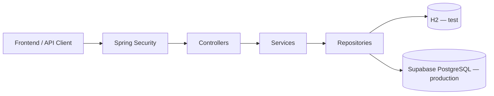
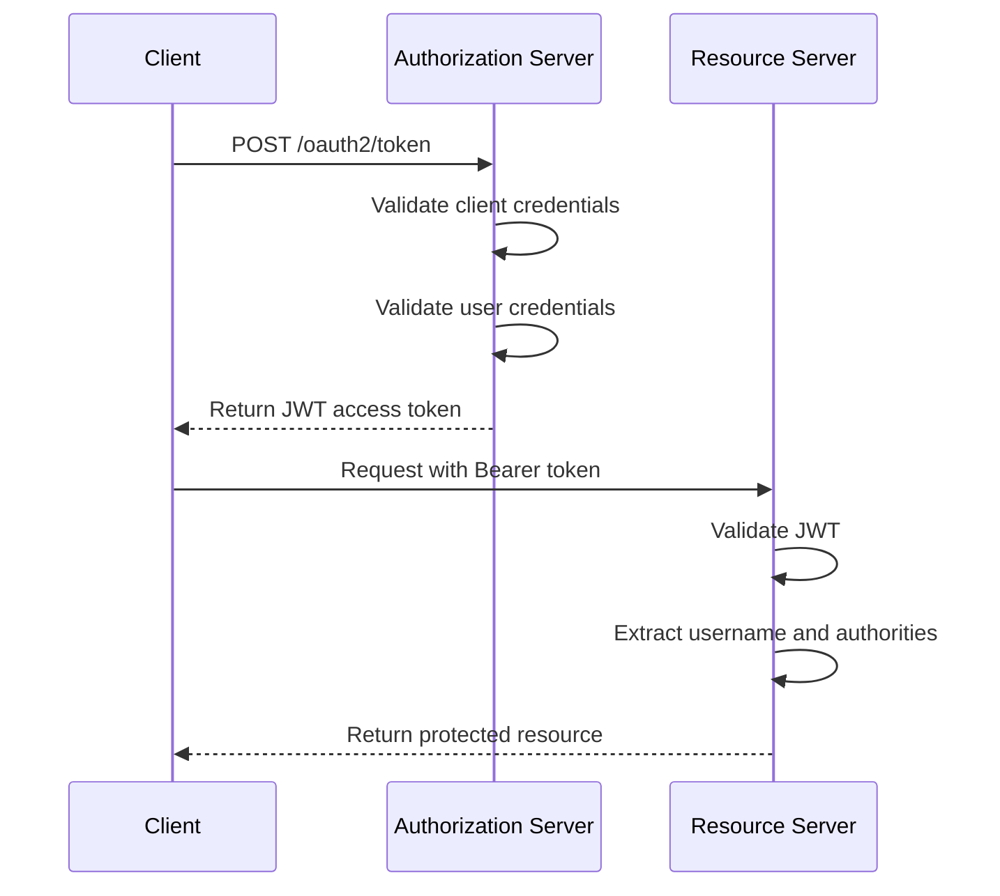
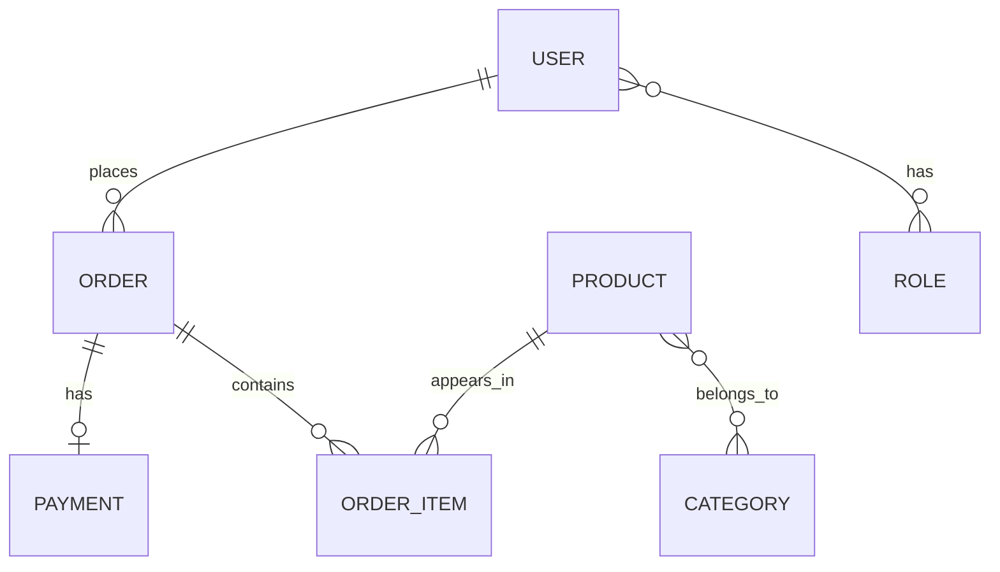

# DSCommerce - Spring Boot E-commerce Backend

A backend-focused e-commerce API built with Spring Boot.
This project highlights authentication and authorization with JWT, role-based access control, layered architecture, JPA entity relationships, validation, and exception handling.

It is the main backend project in my portfolio and was originally developed during the DevSuperior Spring Boot Professional course, then expanded and refined through additional implementation, testing, and deployment work.

**Live API:** https://project-spring-boot-dscommerce.onrender.com/

A separate frontend is available as a visual client for the API: [dscommerce-frontend](https://github.com/mateusribeirocampos/dscommerce-frontend)

## Tech Stack

- Java 21
- Spring Boot 3.4
- Spring Security
- OAuth2 Authorization Server
- JWT
- Spring Data JPA
- PostgreSQL
- H2
- Maven
- Supabase (production database)
- Render.com (cloud hosting)

## Architecture



The project follows a layered backend structure. In production, the API is hosted on Render.com and uses a Supabase PostgreSQL database. Locally, the `test` profile runs with an H2 in-memory database.

- Controllers handle HTTP requests and responses
- Services contain business rules and authorization checks
- Repositories handle persistence with Spring Data JPA
- Security is handled with Spring Security, OAuth2, and JWT

## Security Flow



Authentication is based on JWT access tokens issued by the authorization server.  
Authorization combines endpoint-level role checks with business rules such as owner-or-admin access.

## Domain Model



## Main Endpoints

### Public

- `POST /oauth2/token`
- `GET /products`
- `GET /products/{id}`
- `GET /categories`
- `POST /users/register`

### Authenticated

- `GET /users/me`
- `PUT /users/me`
- `GET /orders/{id}`
- `POST /orders`

### Admin

- `POST /products`
- `PUT /products/{id}`
- `DELETE /products/{id}`
- `POST /categories`
- `PUT /categories/{id}`
- `DELETE /categories/{id}`
- `GET /orders`

## Example Authentication Request

```http
POST /oauth2/token
Content-Type: application/x-www-form-urlencoded

grant_type=password
&username=maria@gmail.com
&password=123456
&client_id=myclientid
&client_secret=myclientsecret
```

## Running Locally

### Requirements

- Java 21
- Maven 3.8+
- PostgreSQL, if you want to use the `dev` or `prod` profile

### Default Profile

The application uses the `test` profile by default:

```yaml
spring:
  profiles:
    active: ${SPRING_PROFILES_ACTIVE:test}
```

That means the project can start with H2 unless you explicitly choose another profile.

### Run

```bash
./mvnw spring-boot:run
```

Otherwise:

```bash
mvn spring-boot:run
```

### Run with a Specific Profile

```bash
SPRING_PROFILES_ACTIVE=dev mvn spring-boot:run
```

## Test Strategy

The repository includes tests for:

- repository layer
- service layer
- controller layer

At the moment, the test suite still needs refinement to improve execution consistency in the current local JDK 21 environment, especially around Mockito setup.

## Frontend Repository

A separate frontend repository was created to provide a visual client for the API:

[dscommerce-frontend](https://github.com/mateusribeirocampos/dscommerce-frontend)

The backend remains the main focus of this portfolio project.

## Notes and Tradeoffs

- This project is primarily a backend portfolio and study project
- The custom password grant flow was implemented for learning purposes
- Some security and token-generation decisions were simplified for educational scope
- The frontend is complementary and not the main evaluation target for this repository
