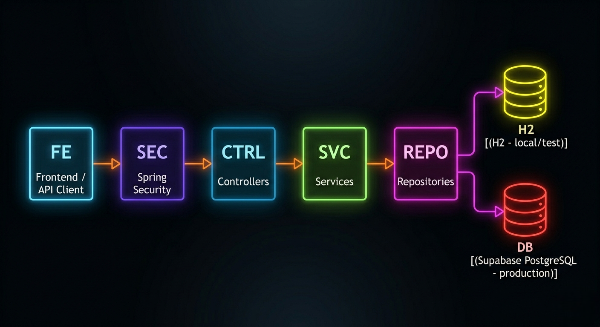
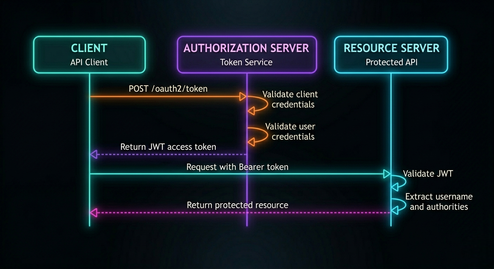
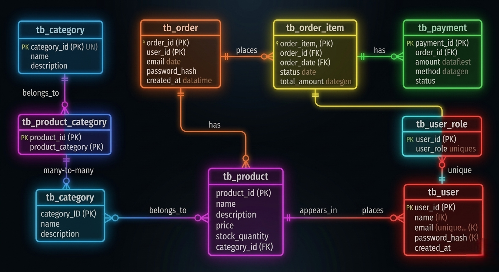

# DSCommerce - Spring Boot E-commerce Backend


[](https://mvnrepository.com/artifact/org.springframework.boot/spring-boot-starter-actuator)

[](docs/openapi.json)

A backend-focused e-commerce API built with Spring Boot, designed to showcase secure authentication and authorization, role-based access control, layered architecture, JPA entity relationships, validation, exception handling, automated tests, and production-oriented deployment.

This is the main backend project in my portfolio and reflects my focus on building secure, maintainable RESTful APIs with Java and Spring Boot.

**Live API:** https://project-spring-boot-dscommerce.onrender.com/

**Frontend demo:** [dscommerce-frontend.vercel.app](https://dscommerce-frontend.vercel.app/) — ([GitHub repo](https://github.com/mateusribeirocampos/dscommerce-frontend))


---

## Overview

DSCommerce is a RESTful backend for an e-commerce domain, covering core business entities such as users, roles, products, categories, orders, payments, and order items.

The project emphasizes:

- Secure API access with JWT-based authentication
- Role-based authorization for protected resources
- Layered backend architecture
- JPA domain modeling and entity relationships
- Validation and centralized exception handling
- Environment-based configuration for local and production usage
- Deployment to a cloud environment with PostgreSQL

---

## Key Features

- JWT-based authentication and authorization via custom OAuth2 password grant
- Refresh token rotation — `JdbcOAuth2AuthorizationService` persists sessions in PostgreSQL; each use issues a new token and invalidates the previous one (RFC 6749 §6)
- JWT RSA key loaded from PKCS12 KeyStore — stable `kid`, tokens survive application restart and multi-instance deployments
- Role-based access control (public, authenticated, and admin routes)
- OAuth2 Authorization Server integration with Spring Authorization Server
- Password recovery via tokenized email (10-minute expiry, Resend API)
- Scheduled cleanup of expired OAuth2 authorizations (daily at 03:00 UTC)
- Layered architecture with Controllers, Services, and Repositories
- JPA/Hibernate mapping for a relational e-commerce domain
- Bean Validation and centralized exception handling
- H2 profile for local/test execution
- PostgreSQL in production
- Flyway-managed versioned database migrations
- BCrypt password hashing (work factor 12)
- Code coverage enforcement with JaCoCo (minimum 40% line coverage gate)
- Deployed API running on Render
- Separate frontend client consuming the backend API
- Interactive API documentation with Swagger UI (springdoc-openapi 2.7.0), including OAuth2 token generation directly from the browser

---

## Tech Stack

- Java 21
- Spring Boot 3.4.3
- Spring Security
- Spring Authorization Server (OAuth2 + custom password grant)
- JWT — RSA 2048 via PKCS12 KeyStore
- Spring Data JPA / Hibernate
- PostgreSQL
- H2 (test/dev)
- Flyway (database migrations)
- BCrypt (work factor 12)
- Maven
- Resend (transactional email API)
- Supabase (production database)
- Render.com (cloud hosting)
- Docker (containerization for Render deployment)
- JaCoCo (code coverage)
- springdoc-openapi 2.7.0 (OpenAPI 3 / Swagger UI)

---

## Architecture



The project follows a layered backend architecture with clear separation of concerns:

- **Controllers** handle HTTP requests and responses
- **Services** encapsulate business rules and authorization checks
- **Repositories** manage persistence with Spring Data JPA
- **Security** is implemented with Spring Security, OAuth2, and JWT

In production, the API is deployed on Render and connected to a Supabase PostgreSQL database.
The frontend is deployed on Vercel and connected to Render.
Locally, the `test` profile uses an H2 in-memory database for simplified execution and testing.

---

## Security Flow



Authentication is based on JWT access tokens issued by the authorization server using a custom password grant (not the deprecated ROPC flow).

Authorization combines endpoint-level role checks with business rules such as owner-or-admin access.

The RSA key pair is loaded from a PKCS12 KeyStore (`.p12`) at startup. This gives the JWT a stable `kid` (Key ID), so tokens remain valid across application restarts and multi-instance deployments — a prerequisite for refresh token persistence.

Refresh tokens are stored in PostgreSQL via `JdbcOAuth2AuthorizationService`. Each use issues a new token and invalidates the previous one (rotation). Expired records are purged daily by a scheduled background job.

---

## Domain Model



---

## API Overview

### Public Endpoints

- `POST /oauth2/token` — get JWT access token (custom password grant) or exchange a refresh token for a new access token (`grant_type=refresh_token`)
- `GET /products` — paginated product listing
- `GET /products/{id}` — product detail
- `GET /categories` — list all categories
- `POST /users/register` — create account
- `POST /auth/forgot-password` — request password reset email
- `POST /auth/reset-password` — reset password with recovery token

### Authenticated Endpoints

- `GET /users/me` — current user profile
- `PUT /users/me` — update own profile
- `GET /orders/{id}` — order detail (owner or admin)
- `POST /orders` — place an order

### Admin Endpoints

- `POST /products`
- `PUT /products/{id}`
- `DELETE /products/{id}`
- `POST /categories`
- `PUT /categories/{id}`
- `DELETE /categories/{id}`
- `GET /orders`

---

## API Documentation

Interactive API documentation is available via Swagger UI at:

```
http://localhost:8080/swagger-ui/index.html
```

All endpoints are documented with request/response schemas, validation rules, and error responses.

### Authentication in Swagger UI

1. Open the **Authentication** section and execute `POST /oauth2/token` — credentials are pre-filled from application properties
2. Copy the `access_token` value from the response
3. Click **Authorize** (top right) and paste the token
4. All subsequent requests will include the `Authorization: Bearer <token>` header automatically

> **Note:** Swagger UI is disabled in the production profile (`springdoc.swagger-ui.enabled=false`).

---

## Example Authentication Request

### Login (password grant)

```http
POST /oauth2/token
Content-Type: application/x-www-form-urlencoded

grant_type=password
&username=maria@gmail.com
&password=123456
&client_id=myclientid
&client_secret=myclientsecret
```

Response includes both `access_token` (15 min) and `refresh_token` (30 days).

### Refresh token rotation

```http
POST /oauth2/token
Content-Type: application/x-www-form-urlencoded

grant_type=refresh_token
&refresh_token=<refresh_token_value>
&client_id=myclientid
&client_secret=myclientsecret
```

Returns a new `access_token` and a new `refresh_token`. The previous refresh token is immediately invalidated — reuse returns `400 invalid_grant`.

---

## Production Notes

- Deployed on [Render](https://render.com)
- Supabase PostgreSQL as production database
- Separate frontend client available at [dscommerce-frontend.vercel.app](https://dscommerce-frontend.vercel.app/) for integration and demo

---

## Running Locally

### Requirements

- Java 21
- Maven 3.8+
- PostgreSQL, if you want to use the `dev` or `prod` profile

### Environment Variables

Create a `.env` file at the project root (not committed — see `.gitignore`):

| Variable | Description | Example |
|----------|-------------|---------|
| `JWT_KEYSTORE_PASSWORD` | Password used when generating the `.p12` | `changeit` |
| `JWT_KEYSTORE_BASE64` | Base64-encoded `.p12` file (required in production) | `$(base64 -w 0 certs/...)` |
| `JWT_KEY_ALIAS` | Alias used when generating the `.p12` | `dscommerce-jwt` |
| `CLIENT_ID` | OAuth2 client identifier | `myclientid` |
| `CLIENT_SECRET` | OAuth2 client secret | `myclientsecret` |
| `CORS_ORIGINS` | Allowed CORS origins (comma-separated) | `http://localhost:3000` |
| `EMAIL_FROM_ADDRESS` | Sender address for transactional emails | `onboarding@resend.dev` |

The `test` profile uses hardcoded fallback values for all variables — running `mvn test` requires no `.env`.

### JWT KeyStore Setup

The `.p12` file is not committed to the repository. Generate it once before running locally:

```bash
keytool -genkeypair \
  -alias dscommerce-jwt \
  -keyalg RSA \
  -keysize 2048 \
  -storetype PKCS12 \
  -keystore src/main/resources/certs/dscommerce-jwt.p12 \
  -validity 3650 \
  -storepass YOUR_PASSWORD
```

For production (PaaS env var), encode the file to base64:

```bash
base64 -w 0 src/main/resources/certs/dscommerce-jwt.p12
```

Set the output as `JWT_KEYSTORE_BASE64` in your deployment environment.

### Default Profile

The application uses the `test` profile by default:

```yaml
spring:
  profiles:
    active: ${SPRING_PROFILES_ACTIVE:test}
```

This means the project can start with H2 unless another profile is explicitly selected.

### Run the Application

Using Maven Wrapper:

```bash
./mvnw spring-boot:run
```

Or using Maven directly:

```bash
mvn spring-boot:run
```

### Run with a Specific Profile

```bash
SPRING_PROFILES_ACTIVE=dev mvn spring-boot:run
```

---

## Testing

The test suite covers multiple layers:

- **Repository** — `@DataJpaTest` with H2 (query validation)
- **Service** — `@ExtendWith(MockitoExtension.class)` (business logic isolation)
- **Controller unit tests** — `@WebMvcTest` (HTTP behavior, validation, exception handling)
- **Integration tests** — `@SpringBootTest` + `MockMvc` (real Spring context, security filters, JWT flow, and H2 database)

Main testing tools used in the project include:

- JUnit 5
- Mockito
- Spring Boot Test
- MockMvc
- Spring Security Test
- JaCoCo — code coverage reports generated on every build, with a minimum 40% line coverage gate enforced via `mvn verify`

Use `./mvnw test` for the fast unit/controller slice suite. Use `./mvnw verify` before publishing changes; this also runs `*IT` integration tests through Failsafe and enforces the JaCoCo coverage gate.

### Running with Docker

A `Dockerfile` is included and used for deployment on Render. It can also be used to run the application locally in a container:

```bash
docker build -t dscommerce .
docker run -e SPRING_PROFILES_ACTIVE=test -p 8080:8080 dscommerce
```

---

## Frontend Integration

A separate frontend repository is available to provide a visual client for the API:

- **Live demo:** [dscommerce-frontend.vercel.app](https://dscommerce-frontend.vercel.app/)
- **GitHub:** [mateusribeirocampos/dscommerce-frontend](https://github.com/mateusribeirocampos/dscommerce-frontend)

The backend remains the main focus of this portfolio project.

---

## Design Notes

- This project prioritizes backend architecture, security, and API design
- The custom password grant flow was kept for learning and portfolio purposes
- Some authentication and token-related decisions were simplified compared to a full enterprise IAM solution
- The frontend is complementary and serves as a client for API interaction
- Swagger UI is enabled only in local/dev profiles; it is disabled in production to avoid exposing internal API structure

---

## Project Evolution

This project was initially inspired by coursework from the DevSuperior Spring Boot Professional program and later evolved into a broader portfolio backend through additional implementation, integration of new features, documentation improvements, testing efforts, and production deployment.

---

## Author

**Mateus Ribeiro de Campos**  
[](https://github.com/mateusribeirocampos)
[](https://www.linkedin.com/in/mateus-ribeiro-de-campos-6a135331/)
[](https://portfolio-mateusribeirocampos.vercel.app/)
