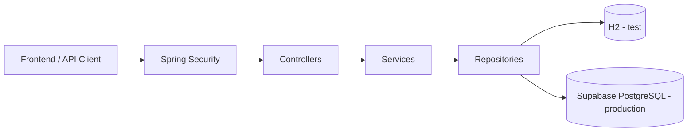
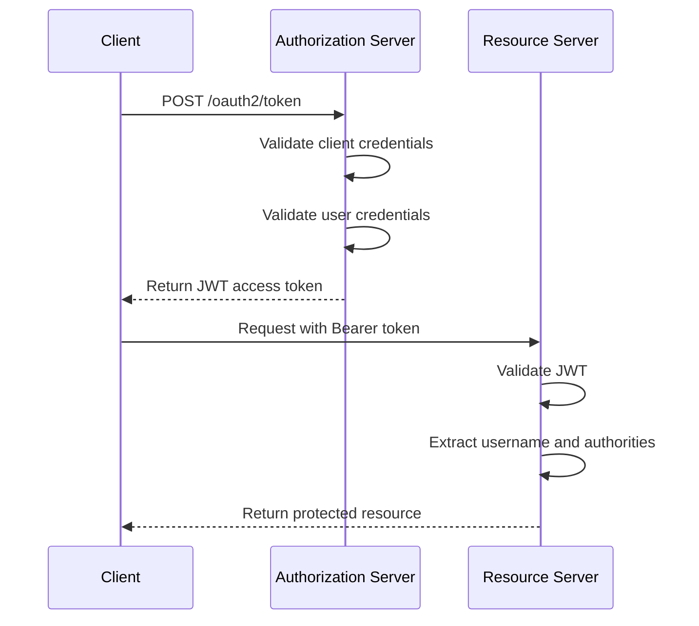
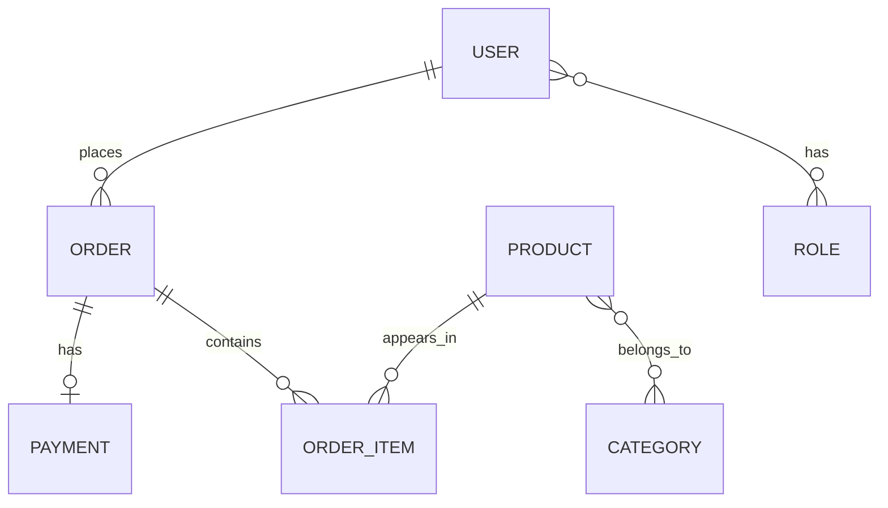

# DSCommerce - Spring Boot E-commerce Backend

A backend-focused e-commerce API built with Spring Boot, designed to demonstrate secure authentication and authorization, role-based access control, layered architecture, JPA entity relationships, validation, exception handling, and production-oriented deployment.

This is the main backend project in my portfolio and reflects my focus on building secure, maintainable RESTful APIs with Java and Spring Boot.

**Live API:** https://project-spring-boot-dscommerce.onrender.com/

A separate frontend is available as a visual client for the API: [dscommerce-frontend](https://github.com/mateusribeirocampos/dscommerce-frontend)

## Tech Stack

- Java 21
- Spring Boot 3.4
- Spring Security
- OAuth2 Authorization Server
- JWT
- Spring Data JPA
- PostgreSQL
- H2 (local/test profile)
- Maven
- Supabase (production database)
- Render.com (cloud hosting)

## Architecture



The project follows a layered backend architecture with clear separation of concerns.

- **Controllers** handle HTTP requests and responses
- **Services** encapsulate business rules and authorization checks
- **Repositories** manage persistence with Spring Data JPA
- **Security** is implemented with Spring Security, OAuth2, and JWT

In production, the API is deployed on Render.com and connected to a Supabase PostgreSQL database. Locally, the `test` profile uses an H2 in-memory database for simplified execution and testing.

## Security Flow



Authentication is based on JWT access tokens issued by the authorization server.  
Authorization combines endpoint-level role checks with business rules such as owner-or-admin access.

## Domain Model



## Main Endpoints

### Public

- `POST /oauth2/token`
- `GET /products`
- `GET /products/{id}`
- `GET /categories`
- `POST /users/register`

### Authenticated

- `GET /users/me`
- `PUT /users/me`
- `GET /orders/{id}`
- `POST /orders`

### Admin

- `POST /products`
- `PUT /products/{id}`
- `DELETE /products/{id}`
- `POST /categories`
- `PUT /categories/{id}`
- `DELETE /categories/{id}`
- `GET /orders`

## Example Authentication Request

```http
POST /oauth2/token
Content-Type: application/x-www-form-urlencoded

grant_type=password
&username=maria@gmail.com
&password=123456
&client_id=myclientid
&client_secret=myclientsecret
```

## Running Locally

### Requirements

- Java 21
- Maven 3.8+
- PostgreSQL, if you want to use the `dev` or `prod` profile

### Default Profile

The application uses the `test` profile by default:

```yaml
spring:
  profiles:
    active: ${SPRING_PROFILES_ACTIVE:test}
```

That means the project can start with H2 unless you explicitly choose another profile.

### Run

```bash
./mvnw spring-boot:run
```

Or:

```bash
mvn spring-boot:run
```

### Run with a Specific Profile

```bash
SPRING_PROFILES_ACTIVE=dev mvn spring-boot:run
```

## Test Strategy

The repository includes automated tests covering:

- repository layer
- service layer
- controller layer

The test suite is being continuously refined to improve consistency and maintainability in the current Java 21 environment.

## Design Notes

- This project prioritizes backend architecture, security, and API design
- The custom password grant flow was kept for learning and portfolio purposes
- Some authentication and token-related decisions were simplified compared to a full enterprise IAM solution
- The frontend is complementary and serves as a client for API interaction

## Project Evolution

This project was initially inspired by coursework from the DevSuperior Spring Boot Professional program and later evolved into a broader portfolio backend through additional implementation, integration of new features, documentation improvements, testing efforts, and production deployment.